
<h1 align="center">基于的网上房屋中介管理系统+vue</h1>

## 简介
基于SSM的网上房屋中介管理系统，角色分为管理员、用户；功能包括房屋管理、用户管理、公告管理、房屋审核、统计报表和在线支付等，界面设计简洁，支持多种操作平台。    --计算机毕业设计源码；毕设源码；java毕业设计源码

## 联系方式

<h3 align="center">获取完整代码与数据库文件 + 微信：deepguan QQ: 86050149 QQ群: 783742310</h3>

<h3 align="center">可帮忙远程部署 包运行成功！提供远程部署、修改代码、设计文档指导、代码讲解等服务！</h3>

## 功能介绍（完整见运行截图）
管理员：基本功能包括登录、首页管理和系统退出。可以通过导航栏管理首页、房屋类型、户型、房屋信息、公告及用户，具备数据的添加、更新、删除和审批功能。提供用户审核模块，支持用户信息的查看和修改，公告发布管理，区域及房屋审核，查看统计报表以分析房屋销售趋势，进行数据导出，方便整体系统维护和管理。

用户：基本功能包含注册、登录和个人中心管理。可以在首页通过轮播图查看房屋推荐，使用搜索和筛选功能找到特定房屋信息。支持房屋的信息查看和详情页面浏览，包括房屋的基础信息、价格、图片及状态，进行在线充值以便订单购买。个人中心可以查看和修改用户信息，如联系方式和身份证号，以及管理房屋收藏和订单交易。

## 运行截图
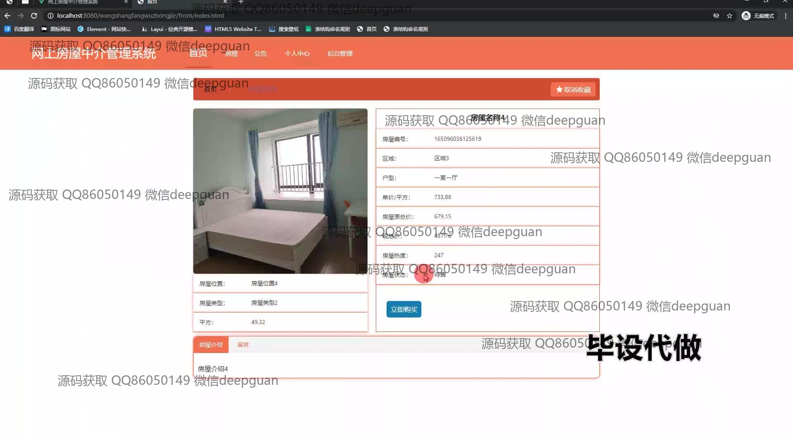
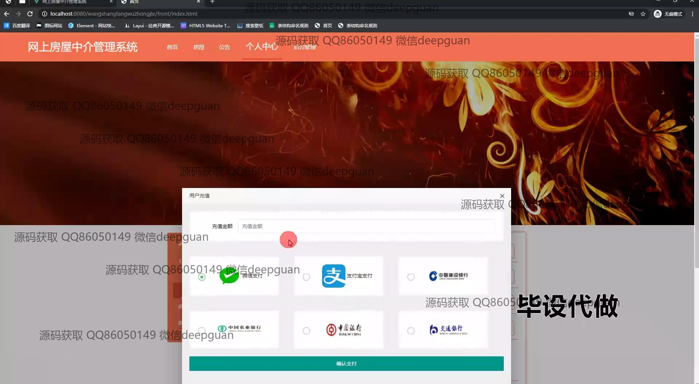
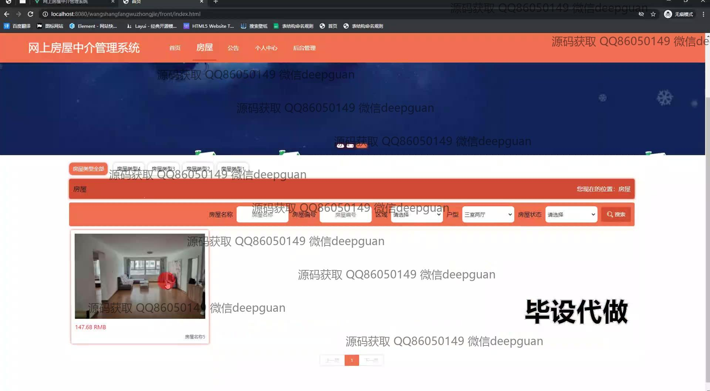
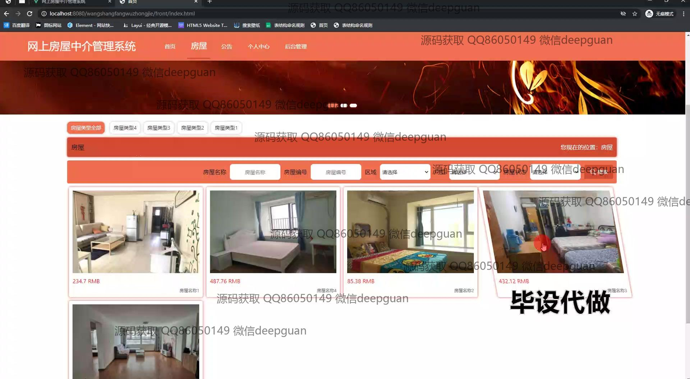
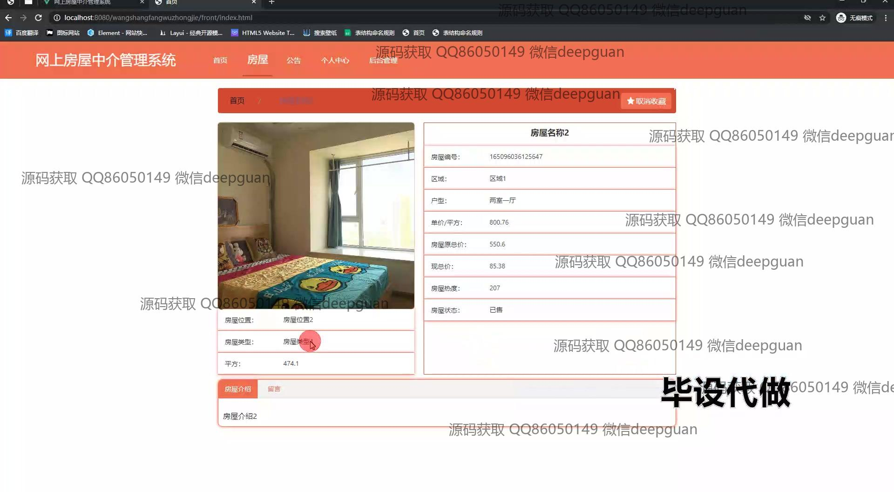
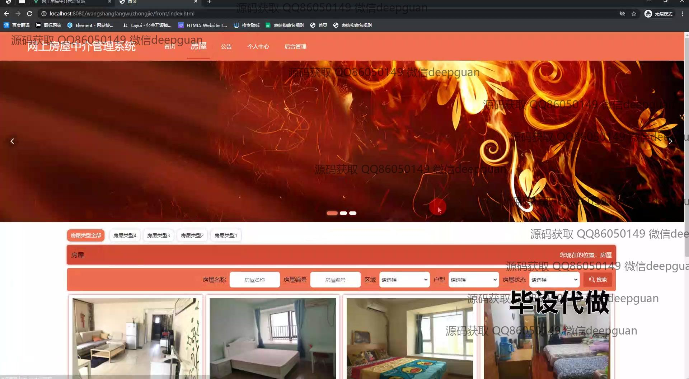
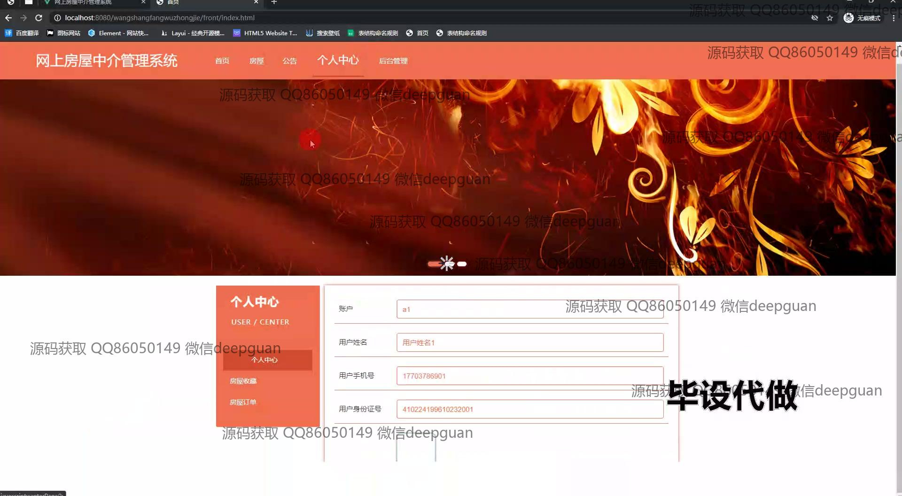
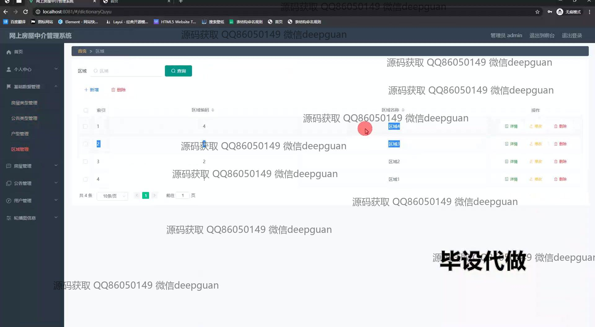
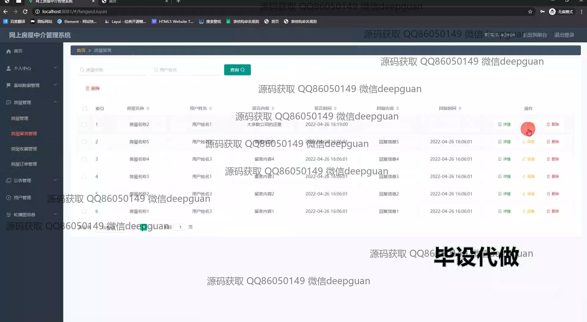
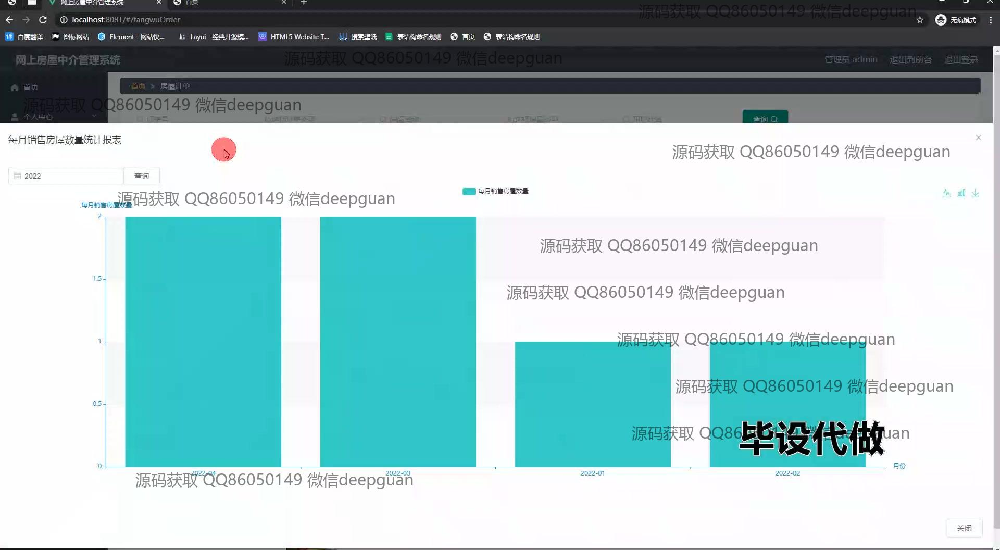
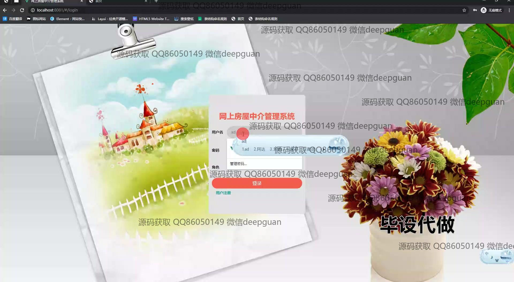
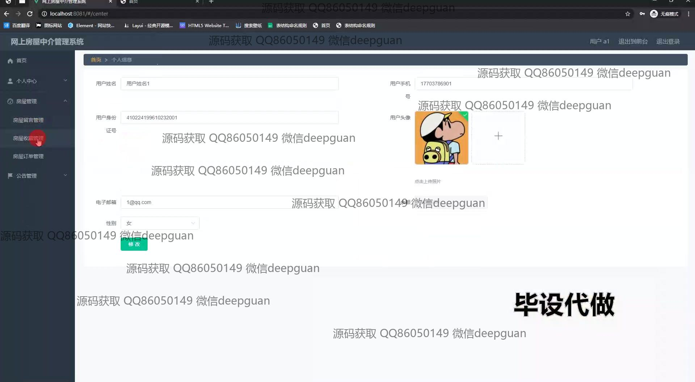
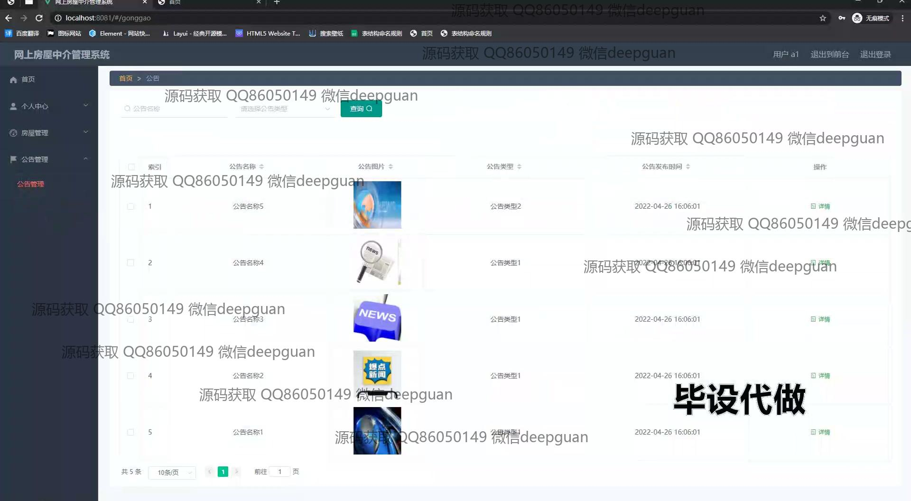

本代码来源于网络,仅供学习参考使用!

